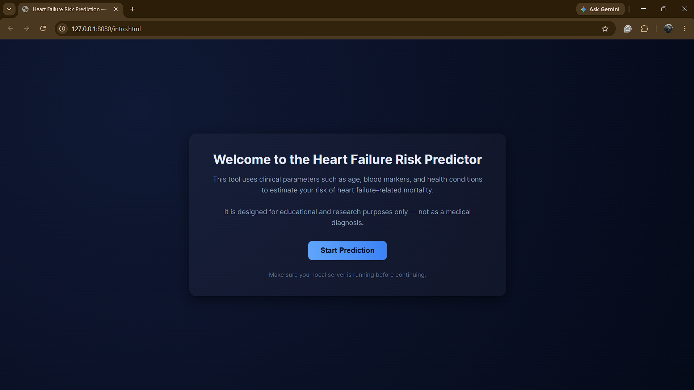
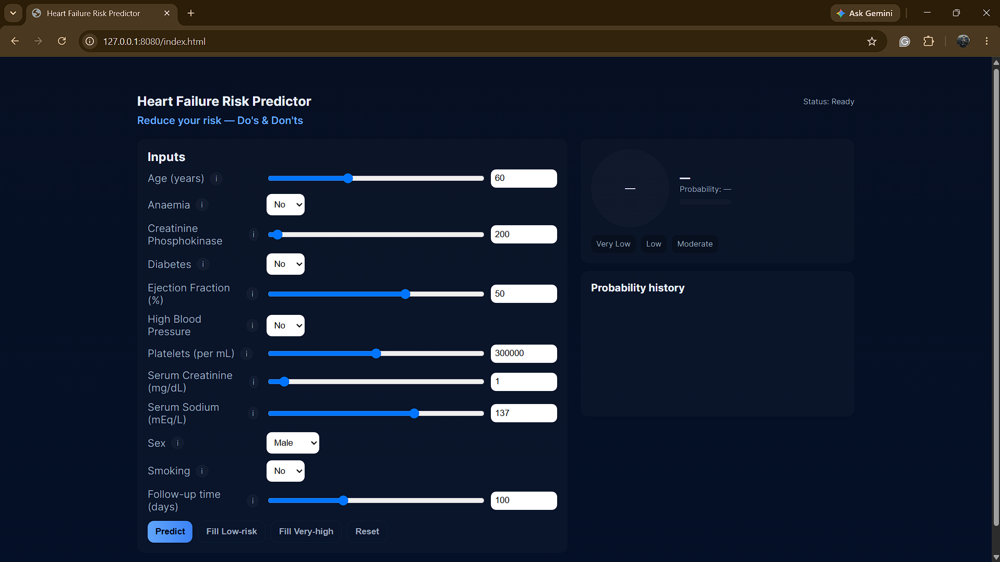
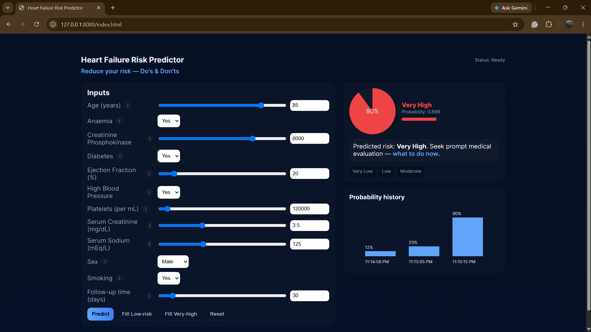
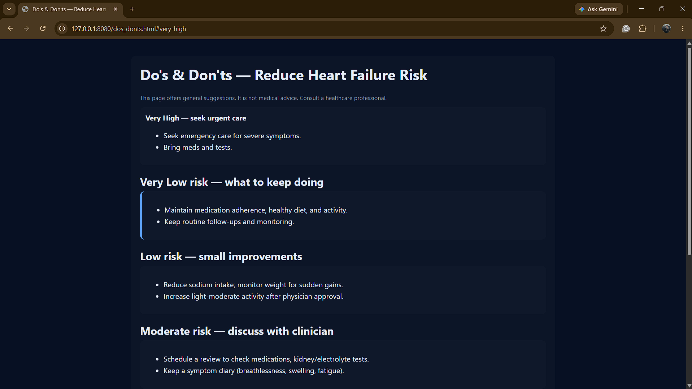

# ❤️ Heart Failure Mortality Prediction System

<p align="center">


</p>

An end-to-end **Machine Learning-powered web application** that predicts the mortality risk of heart failure patients using clinical parameters. The application combines a **tuned XGBoost classifier**, **FastAPI backend**, and an **interactive web interface** to provide real-time mortality risk predictions categorized into **five clinically meaningful risk levels**.

---

# 📖 Project Overview

Heart failure is one of the leading causes of death worldwide. Early identification of high-risk patients enables timely medical intervention and improves treatment outcomes.

This project leverages machine learning techniques to analyze clinical parameters and predict a patient's mortality risk. The trained model is integrated with a FastAPI backend and an intuitive frontend that allows users to obtain predictions instantly.

---

# ✨ Key Features

- 🧠 Machine Learning-based mortality prediction
- ⚡ Real-time prediction using FastAPI
- 🌐 Interactive HTML/CSS/JavaScript frontend
- 📊 Five-level mortality risk categorization
- 💡 Personalized health recommendations
- 📈 Probability-based prediction output
- 🔄 REST API integration

---

# 📸 Application Screenshots

## 🏠 Landing Page

The welcome page introduces the application and allows users to begin the prediction process.

<p align="center">
  
</p>

---

## 📝 Patient Information & Prediction

Users enter the patient's clinical information through an intuitive interface. The system processes the input using the trained XGBoost model and displays the predicted mortality risk along with the probability score.

<p align="center">
  
  
</p>

---

## 💡 Personalized Health Recommendations

Based on the predicted risk category, the application provides tailored health recommendations and preventive guidance for the patient.

<p align="center">
  
</p>

---
# 🛠️ Tech Stack

## Machine Learning

- Python
- XGBoost
- Scikit-learn
- Pandas
- NumPy
- Joblib

## Backend

- FastAPI
- Uvicorn

## Frontend

- HTML
- CSS
- JavaScript

## Development

- Jupyter Notebook
- Visual Studio Code

---

# 📊 Dataset

The project uses the **Heart Failure Clinical Records Dataset** containing **299 patient records** with **13 clinical attributes**.

### Input Features

- Age
- Anaemia
- Creatinine Phosphokinase (CPK)
- Diabetes
- Ejection Fraction
- High Blood Pressure
- Platelets
- Serum Creatinine
- Serum Sodium
- Sex
- Smoking
- Follow-up Time

### Target Variable

**DEATH_EVENT**

- 0 → Patient Survived
- 1 → Patient Died

---

# 🤖 Machine Learning Pipeline

```
Dataset
      │
      ▼
Data Preprocessing
      │
      ▼
Feature Scaling
      │
      ▼
Model Training
      │
      ▼
Hyperparameter Tuning
      │
      ▼
Best XGBoost Model
      │
      ▼
FastAPI Backend
      │
      ▼
Interactive Web Application
```

---

# 📈 Model Performance

| Metric | Value |
|---------|-------|
| Algorithm | XGBoost |
| Accuracy | **93.2%** |
| ROC-AUC Score | **0.879** |
| Prediction Type | Binary Classification |

Among the evaluated models (**Logistic Regression, Random Forest, SVM, and XGBoost**), the tuned **XGBoost classifier** demonstrated the best predictive performance due to its ability to effectively model nonlinear relationships while handling class imbalance.

---

# 📊 Risk Categories

| Probability | Risk Level |
|-------------|------------|
| < 0.05 | 🟢 Very Low |
| 0.05 – 0.15 | 🟢 Low |
| 0.15 – 0.35 | 🟡 Moderate |
| 0.35 – 0.70 | 🟠 High |
| ≥ 0.70 | 🔴 Very High |

---

# 📂 Project Structure

```
Heart-Failure-Mortality-Prediction/
│
├── screenshots/
│   ├── home_page.png
│   ├── prediction_form.png
│   ├── prediction_result.png
│   └── dos_donts.png
│
├── static/
│   ├── index.html
│   ├── intro.html
│   └── dos_donts.html
│
├── api.py
├── Prediction_Mortality_Of_Heart_Failure_Patients.ipynb
├── final_heart_failure_xgb.pkl
├── scaler.pkl
├── heart_failure_clinical_records_dataset.csv
├── requirements.txt
├── README.md
└── .gitignore
```

---

# 🚀 Installation

Clone the repository

```bash
git clone https://github.com/Sujal0973/Heart-Failure-Mortality-Prediction.git
```

Navigate to the project

```bash
cd Heart-Failure-Mortality-Prediction
```

Install dependencies

```bash
pip install -r requirements.txt
```

Start the FastAPI server

```bash
uvicorn api:app --reload
```

Open the frontend in your browser.

---

# 🎯 Project Objectives

- Predict mortality risk using machine learning
- Identify clinically significant patient attributes
- Build a FastAPI-powered prediction API
- Develop an interactive web application
- Provide personalized healthcare recommendations

---

# 🔮 Future Enhancements

- ☁️ Cloud deployment (AWS / Render / Azure)
- 📱 Mobile responsive interface
- 📈 Explainable AI (SHAP)
- 🏥 Electronic Health Record (EHR) integration
- 👤 User authentication
- 📊 Prediction history dashboard

---

# 👨‍💻 Authors

**Sujal Agrahari**

Artificial Intelligence & Machine Learning

Dr. Ambedkar Institute of Technology

---

**Co-Author**

Saheel Pradhan

---

**Project Guide**

Mrs. Rajeshwari

Assistant Professor

Department of AIML

---

## ⭐ Acknowledgement

This project was developed as part of the Mini Project under the Department of Artificial Intelligence and Machine Learning, Dr. Ambedkar Institute of Technology.
