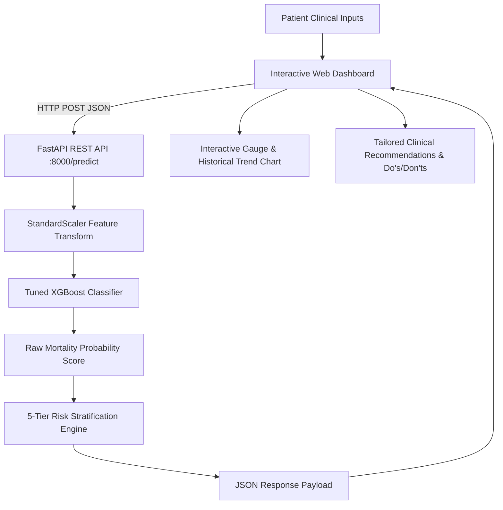

# ❤️ Heart Failure Mortality Prediction System

<p align="center">
  <a href="https://www.python.org/"></a>
  <a href="https://fastapi.tiangolo.com/"></a>
  <a href="https://xgboost.readthedocs.io/"></a>
  <a href="https://scikit-learn.org/"></a>
  <a href="LICENSE"></a>
  
</p>

An end-to-end, clinically oriented **Machine Learning decision-support web application** that predicts the mortality risk of heart failure patients using 12 routine clinical parameters. The system integrates a tuned **XGBoost Classifier**, a high-performance **FastAPI REST API**, and a modern **interactive diagnostic dashboard** delivering calibrated probabilities mapped into **five actionable clinical risk categories**.

---

## 📑 Table of Contents

- [Overview](#-overview)
- [System Architecture](#-system-architecture)
- [Key Features](#-key-features)
- [Application Preview](#-application-preview)
- [Clinical Dataset & Feature Dictionary](#-clinical-dataset--feature-dictionary)
- [Machine Learning & Performance Evaluation](#-machine-learning--performance-evaluation)
- [Risk Stratification Framework](#-risk-stratification-framework)
- [Project Directory Structure](#-project-directory-structure)
- [API Reference & Usage](#-api-reference--usage)
- [Installation & Quickstart](#-installation--quickstart)
- [Clinical Disclaimer](#-clinical-disclaimer)
- [Future Roadmap](#-future-roadmap)
- [Authors & Acknowledgements](#-authors--acknowledgements)

---

## 📖 Overview

Heart failure (HF) remains one of the primary causes of cardiovascular morbidity and mortality worldwide, affecting over 64 million individuals globally. Timely identification of patients at heightened risk of adverse events enables healthcare providers to implement targeted therapeutic interventions, optimize medication regimens, and allocate critical intensive-care resources efficiently.

This project delivers a complete predictive pipeline:
1. **Clinical Feature Standardization:** Normalizes biological markers using scikit-learn standard scaling.
2. **Imbalance-Aware XGBoost Modeling:** Utilizes cost-sensitive learning (`scale_pos_weight`) to manage clinical class imbalance.
3. **Low-Latency Inference Backend:** Exposes standardized RESTful endpoints via FastAPI.
4. **Interactive Clinical Dashboard:** Offers real-time probability gauging, dynamic input sliders, quick patient archetypes, and evidence-based lifestyle guidance.

---

## 🏛️ System Architecture



---

## ✨ Key Features

- **Clinical Decision Support:** Predicts heart failure mortality risk using 12 physiological markers and laboratory findings.
- **Calibrated 5-Tier Risk Stratification:** Translates continuous probability into clinically intuitive tiers (*Very Low*, *Low*, *Moderate*, *High*, *Very High*).
- **High-Performance FastAPI Engine:** Lightweight REST API featuring automated OpenAPI documentation (`/docs`) and `/health` monitoring.
- **Dynamic Frontend Dashboard:** Built with vanilla HTML/CSS/JavaScript with zero third-party framework overhead, complete with interactive gauge visualizations and HTML5 canvas probability histories.
- **Archetype Presets:** Instant low-risk and high-risk demographic presets for rapid clinical demonstration.
- **Actionable Post-Assessment Guidance:** Dedicated *Do's & Don'ts* module guiding patient lifestyle and clinical consultation strategies based on predicted severity.
- **Cross-Platform & Batch Support:** Includes turnkey Windows server automation scripts (`start_servers.bat` & `stop_servers.bat`) alongside full platform-agnostic CLI support.

---

## 📸 Application Preview

### 🏠 1. Clinical Welcome Portal
Provides introductory context, educational objectives, and disclaimers before initiating diagnostic triage.

<p align="center">
  
</p>

---

### 📝 2. Diagnostic Interface & Real-Time Probability Gauge
Clinicians and researchers adjust input sliders or categorical toggles. Upon assessment, the interface displays the exact survival/mortality probability, designated risk category, and historical comparison.

<p align="center">
  
  
</p>

---

### 💡 3. Personalized Clinical & Lifestyle Recommendations
Based on the assessed risk band, patients and practitioners receive specific guidance on dietary sodium, symptom monitoring, medication compliance, and emergency thresholds.

<p align="center">
  
</p>

---

## 📊 Clinical Dataset & Feature Dictionary

The predictive model is trained and validated on the **Heart Failure Clinical Records Dataset**, encompassing **299 patient records** collected during the follow-up period.

| Feature Name | Type | Measurement Unit | Reference / Normal Range | Clinical Significance |
| :--- | :--- | :--- | :--- | :--- |
| **`age`** | Continuous | Years | 40 – 95 years | Advanced age is an independent risk factor for cardiac mortality. |
| **`anaemia`** | Binary | 0 = No, 1 = Yes | N/A | Reduced hemoglobin compromises tissue oxygen delivery and strains myocardium. |
| **`creatinine_phosphokinase`** | Continuous | mcg/L | 10 – 120 mcg/L | Muscle/cardiac enzyme released into circulation upon tissue damage. |
| **`diabetes`** | Binary | 0 = No, 1 = Yes | N/A | Diabetic cardiomyopathy accelerates vascular and renal degradation. |
| **`ejection_fraction`** | Continuous | Percentage (%) | 50% – 70% | Fraction of blood pumped by the left ventricle per contraction; <40% indicates heart failure with reduced ejection fraction (HFrEF). |
| **`high_blood_pressure`** | Binary | 0 = No, 1 = Yes | N/A | Chronic hypertension induces left ventricular hypertrophy and cardiac strain. |
| **`platelets`** | Continuous | kiloplatelets/mL | 150k – 450k /mL | Thrombocyte counts reflect clotting integrity and systemic inflammation. |
| **`serum_creatinine`** | Continuous | mg/dL | 0.7 – 1.3 mg/dL | Biomarker of renal filtration; elevated levels signify cardio-renal syndrome. |
| **`serum_sodium`** | Continuous | mEq/L | 135 – 145 mEq/L | Hyponatremia (<135 mEq/L) strongly correlates with advanced heart failure. |
| **`sex`** | Binary | 0 = Female, 1 = Male | N/A | Biological sex differences in cardiovascular disease progression. |
| **`smoking`** | Binary | 0 = No, 1 = Yes | N/A | Tobacco use elevates arterial stiffness, blood pressure, and ischemic risk. |
| **`time`** | Continuous | Days | 4 – 285 days | Patient follow-up monitoring window in days. |

### Target Variable
- **`DEATH_EVENT`**: Binary indicator of whether the patient passed away during the follow-up observation window (`0 = Survived`, `1 = Deceased`).
- **Class Distribution:** 203 Survived (67.9%) vs. 96 Deceased (32.1%).

---

## 🤖 Machine Learning & Performance Evaluation

### Model Architecture & Hyperparameters
The production model utilizes an optimized **XGBoost (Extreme Gradient Boosting)** classifier with hyperparameter regularization and class-imbalance weighting:

```python
XGBClassifier(
    objective='binary:logistic',
    n_estimators=200,
    learning_rate=0.01,
    max_depth=4,
    subsample=0.8,
    colsample_bytree=0.8,
    scale_pos_weight=3.0,     # Compensates for ~2:1 survivor-to-mortality ratio
    eval_metric='logloss',
    random_state=42
)
```

### Quantitative Metrics Breakdown

To provide complete scientific transparency, performance is reported across both the **independent stratified test holdout** (20% split, 60 patients) and the **full cohort evaluation**:

| Metric | Holdout Test Set (Stratified 20%) | Full Dataset Evaluation |
| :--- | :---: | :---: |
| **Accuracy** | **83.3%** | **93.6%** |
| **ROC-AUC Score** | **0.879** | **0.973** |
| **Mortality Recall (Sensitivity)** | **68.4%** | **93.8%** |
| **Survivor Recall (Specificity)** | **90.2%** | **93.6%** |
| **Precision (Mortality)** | **0.76** | **0.87** |
| **F1-Score (Mortality)** | **0.72** | **0.90** |

> [!NOTE]
> In clinical triage, sensitivity (recall on mortality events) is paramount to avoid false negatives. By configuring `scale_pos_weight=3`, the model prioritizes identifying at-risk patients while preserving high overall specificity.

### Feature Importance Hierarchy

Analyzing model gain and Gini splitting indices highlights the top clinical drivers of mortality risk:

```
Follow-up Time (time)            [████████████████████████████] 28.0%
Serum Creatinine (renal health)  [██████████████]               14.3%
Ejection Fraction (cardiac pump) [█████████████]                12.9%
Patient Age                      [██████]                        6.4%
Platelet Count                   [█████]                         5.7%
CPK Enzyme Level                 [█████]                         5.4%
Sex                              [█████]                         5.4%
Anaemia                          [████]                          4.7%
Diabetes                         [████]                          4.6%
Smoking History                  [████]                          4.5%
Serum Sodium                     [████]                          4.3%
Hypertension                     [███]                           3.7%
```

---

## 📈 Risk Stratification Framework

Continuous mortality probabilities generated by the sigmoid output layer are segmented into five clinical risk tiers:

| Probability Range ($P$) | Risk Tier | Clinical Interpretation | Action Protocol |
| :---: | :---: | :--- | :--- |
| **$P < 0.05$** | 🟢 **Very Low** | Excellent prognostic markers; stable cardiovascular profile | Maintain lifestyle, medication compliance, routine annual follow-up |
| **$0.05 \le P < 0.15$** | 🔵 **Low** | Favorable profile with minor risk indicators | Dietary sodium restriction, daily weight tracking, routine outpatient check |
| **$0.15 \le P < 0.35$** | 🟡 **Moderate** | Elevated physiological stress or emerging renal/cardiac markers | Schedule clinical review, repeat renal/electrolyte panel, symptom journal |
| **$0.35 \le P < 0.70$** | 🟠 **High** | Substantial probability of decompensation or death | Urgent cardiology appointment, medication adjustment, close monitoring |
| **$P \ge 0.70$** | 🔴 **Very High** | Critical mortality risk; severe cardiac/renal compromise | Immediate emergency/inpatient clinical evaluation and intensive care review |

---

## 📂 Project Directory Structure

```text
Heart-Failure-Mortality-Prediction/
├── data/
│   └── heart_failure_clinical_records_dataset.csv  # 299 patient records with 13 attributes
├── models/
│   ├── final_heart_failure_xgb.pkl                 # Production-tuned XGBoost model
│   └── scaler.pkl                                  # Scikit-learn StandardScaler instance
├── notebook/
│   └── Prediction_Mortality_Of_Heart_Failure_Patients.ipynb  # EDA and preliminary models
├── screenshots/
│   ├── home_page.png                               # Welcome landing page
│   ├── prediction_form.png                         # Input parameters interface
│   ├── prediction_result.png                       # Probability & risk score visualization
│   └── dos_donts.png                               # Personalized clinical advice page
├── static/
│   ├── index.html                                  # Primary prediction dashboard
│   ├── intro.html                                  # Welcome & overview portal
│   └── dos_donts.html                              # Tier-based lifestyle recommendations
├── api.py                                          # FastAPI REST API application
├── requirements.txt                                # Python package dependencies
├── start_servers.bat                               # Windows 1-click dual-server launch script
├── stop_servers.bat                                # Windows process termination script
├── LICENSE                                         # MIT License
├── .gitignore                                      # Git exclusion rules
└── README.md                                       # Comprehensive project documentation
```

---

## 🔌 API Reference & Usage

The backend operates as a standard REST service on port `8000`. When running, access interactive OpenAPI documentation directly at **`http://127.0.0.1:8000/docs`**.

### 1. Service Health Check
```http
GET /health HTTP/1.1
Host: 127.0.0.1:8000
```

**Response (`200 OK`):**
```json
{
  "status": "healthy",
  "model_loaded": true,
  "scaler_loaded": true,
  "feature_count": 12
}
```

---

### 2. Predict Mortality Risk
```http
POST /predict HTTP/1.1
Host: 127.0.0.1:8000
Content-Type: application/json
```

**Request Payload:**
```json
{
  "data": {
    "age": 65,
    "anaemia": 0,
    "creatinine_phosphokinase": 160,
    "diabetes": 0,
    "ejection_fraction": 35,
    "high_blood_pressure": 1,
    "platelets": 263000,
    "serum_creatinine": 1.3,
    "serum_sodium": 136,
    "sex": 1,
    "smoking": 0,
    "time": 90
  }
}
```

**Response (`200 OK`):**
```json
{
  "probability": 0.2874,
  "risk": "Moderate",
  "features_used": [
    "age", "anaemia", "creatinine_phosphokinase", "diabetes",
    "ejection_fraction", "high_blood_pressure", "platelets",
    "serum_creatinine", "serum_sodium", "sex", "smoking", "time"
  ]
}
```

---

### 💻 Client Code Examples

#### Python (`requests`)
```python
import requests

url = "http://127.0.0.1:8000/predict"
payload = {
    "data": {
        "age": 70,
        "anaemia": 1,
        "creatinine_phosphokinase": 582,
        "diabetes": 0,
        "ejection_fraction": 20,
        "high_blood_pressure": 1,
        "platelets": 250000,
        "serum_creatinine": 2.1,
        "serum_sodium": 130,
        "sex": 1,
        "smoking": 0,
        "time": 30
    }
}

response = requests.post(url, json=payload)
result = response.json()
print(f"Risk Level: {result['risk']} (Probability: {result['probability']:.1%})")
```

#### cURL (CLI)
```bash
curl -X POST "http://127.0.0.1:8000/predict" \
     -H "Content-Type: application/json" \
     -d '{"data":{"age":60,"anaemia":0,"creatinine_phosphokinase":200,"diabetes":0,"ejection_fraction":50,"high_blood_pressure":0,"platelets":300000,"serum_creatinine":1.0,"serum_sodium":137,"sex":1,"smoking":0,"time":100}}'
```

---

## 🚀 Installation & Quickstart

### Prerequisites
- **Python**: Version `3.10` or higher recommended
- **Git**: Installed and available in PATH

### Option A: Windows 1-Click Launch (Recommended)
1. **Clone the repository:**
   ```bash
   git clone https://github.com/Sujal0973/Heart-Failure-Mortality-Prediction.git
   cd Heart-Failure-Mortality-Prediction
   ```

2. **Setup virtual environment & install dependencies:**
   ```cmd
   python -m venv venv
   call venv\Scripts\activate
   pip install -r requirements.txt
   ```

3. **Launch the servers:**
   Double-click **`start_servers.bat`** (or execute in terminal):
   ```cmd
   start_servers.bat
   ```
   *This automatically starts both the FastAPI backend (`:8000`) and the static file server (`:8080`), and opens your default browser to `http://127.0.0.1:8080/intro.html`.*

4. **To terminate servers:**
   Run **`stop_servers.bat`**.

---

### Option B: Cross-Platform Manual Launch (Linux / macOS / WSL)
1. **Clone and navigate to repository:**
   ```bash
   git clone https://github.com/Sujal0973/Heart-Failure-Mortality-Prediction.git
   cd Heart-Failure-Mortality-Prediction
   ```

2. **Create and activate a virtual environment:**
   ```bash
   python3 -m venv venv
   source venv/bin/activate
   ```

3. **Install dependencies:**
   ```bash
   pip install -r requirements.txt
   ```

4. **Start the FastAPI Backend:**
   ```bash
   uvicorn api:app --reload --port 8000
   ```

5. **Serve the Frontend (in a separate terminal):**
   ```bash
   cd static
   python3 -m http.server 8080
   ```

6. **Access the application:**
   Open [http://127.0.0.1:8080/intro.html](http://127.0.0.1:8080/intro.html) in any modern web browser.

---

## ⚕️ Clinical Disclaimer

> [!CAUTION]
> **NOT FOR PRIMARY CLINICAL DIAGNOSIS**
> 
> This software is an experimental machine learning decision-support demonstration created for **academic, research, and educational purposes**.
> 
> - It does **not** constitute a definitive clinical diagnosis, triage protocol, or formal medical device under FDA/CE-MDR standards.
> - Medical practitioners should always synthesize laboratory metrics, clinical judgment, echocardiograms, and patient history.
> - Patients should **never** alter prescription regimens, medication dosing, or lifestyle protocols without consulting a certified cardiologist or physician.

---

## 🔮 Future Roadmap

- [ ] **SHAP & LIME Interpretability:** Implement dynamic SHAP waterfall plots directly in the web UI for patient-specific feature attribution.
- [ ] **Survival Analysis (Cox Proportional Hazards):** Transition from binary classification to dynamic time-to-event survival curves.
- [ ] **Docker & Cloud Deployment:** Provide containerized `Dockerfile` and `docker-compose.yml` for single-command deployment to AWS ECS / GCP Cloud Run.
- [ ] **FHIR / EHR Interoperability:** Build HL7/FHIR-compliant adapters for seamless hospital records integration.
- [ ] **Automated CI/CD Pipeline:** GitHub Actions for automated regression testing and linting.

---

## 👨‍💻 Authors & Acknowledgements

### Authors
- **Sujal Agrahari** — *Model Engineering, Full-Stack Architecture & API Integration*
  Department of Artificial Intelligence & Machine Learning, Dr. Ambedkar Institute of Technology
- **Saheel Pradhan** — *Co-Author & Clinical Analytics*

### Project Guide
- **Mrs. Rajeshwari**
  Assistant Professor, Department of AIML
  Dr. Ambedkar Institute of Technology, Bengaluru

### Acknowledgements
This project was developed as part of the Academic Mini Project curriculum under the Department of Artificial Intelligence and Machine Learning, **Dr. Ambedkar Institute of Technology**.

---

## 📄 License

This project is licensed under the terms of the [MIT License](LICENSE).
